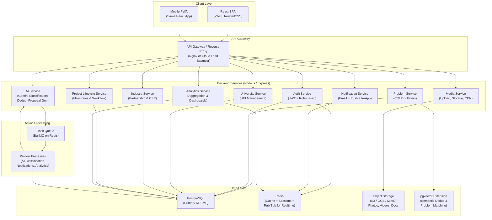

# Jharkhand Societal Innovation Collaboration Portal — Scalable Backend Architecture & Implementation Plan

## Current State Analysis

Your existing codebase is a **well-structured hackathon prototype** built as a single Express + Vite + React monolith:

| Layer | Current Tech | Files |
|-------|-------------|-------|
| **Frontend** | React 19 + TailwindCSS v4 + Framer Motion + D3 + Lucide icons | 13 components in `src/components/` |
| **Backend** | Single Express server ([server.ts](file:///c:/Users/kabir/Downloads/remix-jharkhand-societal-innovation-collaboration-portal/server.ts)) | ~860 lines, all routes in one file |
| **Data** | In-memory arrays (no database) | [jharkhandData.ts](file:///c:/Users/kabir/Downloads/remix-jharkhand-societal-innovation-collaboration-portal/src/data/jharkhandData.ts) — 47KB seed data |
| **AI** | Gemini 3.6 Flash (with heuristic fallback) | Problem analysis, proposal generation, voice transcription |
| **Auth** | None — role is a client-side toggle | No sessions, no JWT |
| **Infra** | Single process, port 3000 | AI Studio/Cloud Run oriented |

### Critical Scalability Gaps

> [!CAUTION]
> The following issues will cause failures at any real-world scale:

1. **No persistence** — all data lives in `let problems: ProblemStatement[] = [...]` in server memory. A restart loses everything.
2. **No authentication/authorization** — anyone can assign problems to HEIs, update statuses, or pledge funds.
3. **Monolithic server** — AI routes, CRUD routes, file uploads, analytics all in one 860-line file.
4. **No file/media storage** — `mediaUrls` are hardcoded Unsplash links; no actual upload pipeline.
5. **No real-time communication** — discussions require page refresh; no WebSocket/SSE.
6. **No deduplication persistence** — AI dedup is a runtime heuristic, not a vector similarity search.
7. **No queue/async processing** — AI calls are synchronous and block the Express request.

---

## Proposed Scalable Backend Architecture



---

## User Review Required

> [!IMPORTANT]
> **Hackathon Scope Decision**: This is a comprehensive production architecture. For a hackathon, I recommend implementing a **Phase 1 subset** that demonstrates scalability *patterns* without over-engineering. Please review the phased approach below and confirm which phase you'd like me to build.

> [!WARNING]
> **Database Choice**: I'm recommending **PostgreSQL** with Prisma ORM. If you prefer MongoDB, Supabase, or Firebase for faster hackathon iteration, let me know — the architecture adapts to any of these.

---

## Open Questions

1. **Hackathon timeline**: How many hours/days do you have left? This determines how much of the architecture we actually implement vs. demonstrate.
2. **Deployment target**: Are you deploying to Cloud Run (as the `.env.example` suggests), Vercel, Railway, or presenting locally?
3. **Authentication**: Do you need actual login flows (Google OAuth, OTP) or is role-switching UI sufficient for the demo?
4. **Database**: Can you spin up a PostgreSQL instance (e.g., Supabase free tier, Neon, Railway) or do you prefer SQLite for portability?
5. **File uploads**: Do you need real file upload for the demo, or are mock URLs acceptable?

---

## Proposed Changes — Phased Approach

### Phase 1: Hackathon MVP (Recommended — 4-6 hours)
*Restructure the backend for scalability patterns while keeping it deployable as a single service*

---

#### Backend Restructuring

##### [NEW] `server/` directory — Modular Express backend

Restructure the monolithic [server.ts](file:///c:/Users/kabir/Downloads/remix-jharkhand-societal-innovation-collaboration-portal/server.ts) into a clean modular architecture:

```
server/
├── index.ts                    # Express app bootstrap
├── config/
│   └── env.ts                  # Centralized environment config
├── middleware/
│   ├── auth.ts                 # JWT verification + role guard
│   ├── errorHandler.ts         # Global error handler
│   ├── rateLimiter.ts          # Rate limiting per endpoint
│   └── validate.ts             # Request validation (Zod schemas)
├── modules/
│   ├── problems/
│   │   ├── problems.routes.ts  # GET/POST/PATCH /api/problems
│   │   ├── problems.service.ts # Business logic
│   │   ├── problems.schema.ts  # Zod validation schemas
│   │   └── problems.model.ts   # Database queries (Prisma)
│   ├── ai/
│   │   ├── ai.routes.ts        # /api/ai/analyze, /api/ai/generate-proposal, /api/ai/transcribe
│   │   ├── ai.service.ts       # Gemini integration + heuristic fallback
│   │   └── ai.queue.ts         # Async job processing for heavy AI tasks
│   ├── universities/
│   │   ├── universities.routes.ts
│   │   └── universities.service.ts
│   ├── industry/
│   │   ├── industry.routes.ts
│   │   └── industry.service.ts
│   ├── proposals/
│   │   ├── proposals.routes.ts
│   │   └── proposals.service.ts
│   ├── discussions/
│   │   ├── discussions.routes.ts
│   │   └── discussions.service.ts
│   ├── analytics/
│   │   ├── analytics.routes.ts
│   │   └── analytics.service.ts
│   ├── notifications/
│   │   ├── notifications.routes.ts
│   │   └── notifications.service.ts
│   └── auth/
│       ├── auth.routes.ts       # /api/auth/login, /api/auth/register, /api/auth/me
│       └── auth.service.ts
└── utils/
    ├── logger.ts               # Structured logging (pino)
    ├── apiResponse.ts          # Standardized API response wrapper
    └── gemini.ts               # Shared Gemini client singleton
```

##### [NEW] `prisma/schema.prisma` — Database schema

Full relational schema covering all entities:
- `User` (citizens, faculty, industry reps, admins) with role-based access
- `Problem` with all fields from your current `ProblemStatement` type
- `AIAnalysis` as a related record (1:1 with Problem)
- `University`, `FacultyMentor`, `IndustryPartner`
- `SolutionProposal`, `ProjectMilestone`
- `Discussion` (threaded messages)
- `Notification`, `AuditLog`
- Vector embedding column on `Problem` for semantic deduplication (pgvector)

##### [MODIFY] [server.ts](file:///c:/Users/kabir/Downloads/remix-jharkhand-societal-innovation-collaboration-portal/server.ts)
Replace the 860-line monolith with a thin entry point that imports the modular router.

---

#### Authentication & Authorization

##### [NEW] `server/modules/auth/`
- JWT-based authentication with refresh tokens
- Role-based middleware: `citizen`, `university_admin`, `faculty`, `industry`, `govt_admin`
- Protected routes: only `govt_admin` can assign HEIs, only `faculty` can submit proposals, etc.
- For hackathon: simple email/password with bcrypt, expandable to Google OAuth

---

#### Database Layer

##### [NEW] `prisma/schema.prisma`

Key tables and relationships:

| Table | Purpose | Key Relations |
|-------|---------|---------------|
| `users` | All portal users | role enum, linked to submissions |
| `problems` | Citizen challenges | → ai_analyses, → discussions, → proposals |
| `ai_analyses` | AI classification results | → matched_heis, → duplicate_matches |
| `universities` | HEI registry | → faculty_mentors, → departments |
| `solution_proposals` | University research proposals | → milestones, → budget_items |
| `project_milestones` | Lifecycle tracking | status workflow, evidence uploads |
| `industry_partners` | CSR & startup registry | → pledges, → collaborations |
| `discussions` | Threaded communication | → problem, → sender |
| `notifications` | In-app + push notifications | type, read status, target role |
| `media_attachments` | Uploaded files metadata | S3 keys, thumbnails |
| `audit_logs` | All state changes | who, what, when |

##### [NEW] `prisma/seed.ts`
Migrate your existing [jharkhandData.ts](file:///c:/Users/kabir/Downloads/remix-jharkhand-societal-innovation-collaboration-portal/src/data/jharkhandData.ts) into a proper database seed script.

---

#### Real-time Communication

##### [NEW] `server/modules/discussions/discussions.ws.ts`
- WebSocket (via `ws` or `socket.io`) for live discussion threads
- Server-Sent Events (SSE) for notification streaming
- Enables seamless interaction among citizens, universities, industry, and government

---

#### Async AI Processing

##### [NEW] `server/modules/ai/ai.queue.ts`
- BullMQ job queue for heavy AI operations (classification, proposal generation)
- Immediate acknowledgment to client → background processing → WebSocket notification on completion
- Retry logic for Gemini API failures with exponential backoff

---

### Phase 2: Production Hardening (Post-hackathon)

- **Object Storage**: MinIO/S3 integration for actual photo/video/document uploads
- **Full-text search**: PostgreSQL tsvector or Elasticsearch for problem search
- **Semantic dedup**: pgvector embeddings via Gemini embedding API for true duplicate detection
- **Email notifications**: Nodemailer + templated emails for lifecycle events
- **API documentation**: Auto-generated Swagger/OpenAPI from Zod schemas
- **CI/CD**: GitHub Actions pipeline for test → build → deploy
- **Monitoring**: Prometheus metrics + Grafana dashboards
- **Containerization**: Docker Compose for local dev, Cloud Run for production

### Phase 3: Scale-Out (Future)

- Break into true microservices with separate deployments
- Event-driven architecture with Google Pub/Sub or Redis Streams
- CDN for media delivery
- Read replicas for analytics queries
- Mobile native apps (React Native sharing component library)

---

## Technology Stack Summary

| Concern | Hackathon (Phase 1) | Production (Phase 2+) |
|---------|---------------------|----------------------|
| **Runtime** | Node.js + Express | Node.js + Fastify (or NestJS) |
| **Database** | PostgreSQL (Supabase/Neon free tier) | PostgreSQL + Redis cluster |
| **ORM** | Prisma | Prisma |
| **Auth** | JWT + bcrypt | JWT + OAuth 2.0 + OTP |
| **AI** | Gemini 3.6 Flash (direct) | Gemini via async queue + caching |
| **Realtime** | Socket.IO | Socket.IO + Redis adapter |
| **Storage** | Local disk / mock URLs | GCS/S3 + CDN |
| **Validation** | Zod schemas | Zod + OpenAPI generation |
| **Logging** | Pino | Pino + Cloud Logging |
| **Queue** | In-process BullMQ | BullMQ + Redis |
| **Frontend** | React + Vite + Tailwind (existing) | Same + PWA manifest |

---

## Verification Plan

### Automated Tests
```bash
# Database migration & seeding
npx prisma migrate dev
npx prisma db seed

# Run unit tests for each service module
npm test

# API integration tests
npm run test:api

# Type checking
npx tsc --noEmit
```

### Manual Verification
- Submit a new problem via the citizen modal → verify it persists across server restarts
- Test AI classification endpoint → verify proper routing to HEI
- Assign a problem to a university → verify auth guards (only admin can assign)
- Submit a proposal → verify milestone lifecycle updates
- Open two browser tabs → verify real-time discussion updates via WebSocket
- Check analytics dashboard → verify aggregated data from database
